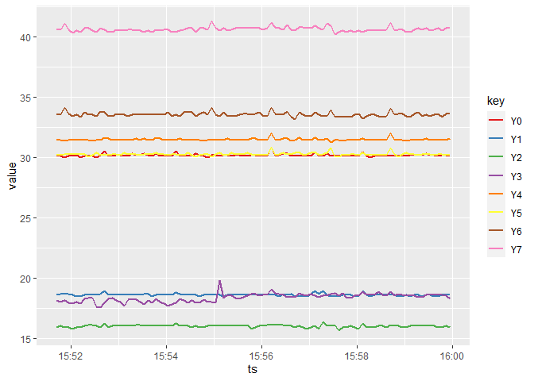

<!-- README.md is generated from README.Rmd. Please edit that file -->

# Rthingsboard

<!-- badges: start -->

<!-- badges: end -->

The goal of Rthingsboard is to provide interaction with the API of
Thingsboard (<https://thingsboard.io/>), an open-source IoT platform for
device management, data collection, processing and visualization.

## Installation

You can install the released version of Rthingsboard from
[CRAN](https://CRAN.R-project.org) with:

``` r
install.packages("Rthingsboard")
```

And the development version from [GitHub](https://github.com/) with:

``` r
# install.packages("devtools")
devtools::install_github("DDorch/Rthingsboard")
```

## Example

This is a basic example which shows you how to extract data from the
following public dashboard :
<http://scada.g-eau.fr/dashboard/4db16100-f3e9-11e8-9dbf-cbc1e37c11e3?publicId=299cedc0-f3e9-11e8-9dbf-cbc1e37c11e3>

### Load library

``` r
library(Rthingsboard)
```

### Define the configuration parameters

``` r
# Identifier of SupAgro Halle hydraulique SCADA
url = "http://scada.g-eau.fr"
publicId = "299cedc0-f3e9-11e8-9dbf-cbc1e37c11e3"
entityId = "18d56d50-f3e9-11e8-9dbf-cbc1e37c11e3"
startDate = as.POSIXct("2020-11-19 9:30:00")
endDate = as.POSIXct("2020-11-19 17:00:00")

# Set logger threshold to DEBUG to see extra messages for debug purpose
logger::log_threshold(logger::DEBUG)
```

### Connexion to the Thingsboard server

First, you need to create an object of class `ThingsboardApi` as follow:

``` r
# Connection to the API
tb_api = ThingsboardApi(url = url, publicId = publicId)
#> DEBUG [2020-11-26 17:46:59] ThingsboardApi$getToken: eyJhbGciOiJI...
#> DEBUG [2020-11-26 17:46:59] ThingsboardApi$getToken: expiration 2020-11-26 17:51:59
```

### Retrieve data from the Thingsboard server

You can get the available keys on the specified device defined by its
`entityId`:

``` r
# Get list of keys
keys = tb_api$getKeys(entityId = entityId)
#> DEBUG [2020-11-26 17:46:59] keys = A0, A1, A10, A2, A3, A4, A5, A6, A7, A8, A9, B0, B1, C1, C3, N0, Q0, Q1, Q2, Q3, Y0, Y1, Y10, Y2, Y3, Y4, Y5, Y6, Y7, Y8, Y9
```

Knowing the name of the available keys, you can get the telemetry of
this device for a given period defined by `startTS` and `endTS`.

Here below, we download the telemetry for all keys beginning by “Y” and
display the top of the table:

``` r
df <- tb_api$getValues(entityId,
                       keys = keys[grep("^Y", keys)],
                       startTs = startDate,
                       endTs = endDate)
#> DEBUG [2020-11-26 17:46:59] getValues query keys=Y0,Y1,Y10,Y2,Y3,Y4,Y5,Y6,Y7,Y8,Y9&startTs=1605774600000&endTs=1605801600000&agg=NONE
knitr::kable(head(df))
```

| key | ts                  |   value |
| :-- | :------------------ | ------: |
| Y0  | 2020-11-19 15:59:57 | 30.1243 |
| Y0  | 2020-11-19 15:59:52 | 30.2338 |
| Y0  | 2020-11-19 15:59:47 | 30.2338 |
| Y0  | 2020-11-19 15:59:42 | 30.1243 |
| Y0  | 2020-11-19 15:59:37 | 30.2338 |
| Y0  | 2020-11-19 15:59:32 | 30.2338 |

You can then record this table into a file in the current directory:

``` r
# getwd() # to get the path of the current directory
write.csv2(df, "myData.csv")
```

And also plot some time series:

``` r
library(ggplot2)
ggplot(df, aes(x = ts, y = value)) + 
  geom_line(aes(color = key), size = 1) +
  scale_color_brewer(palette = "Set1")
```


